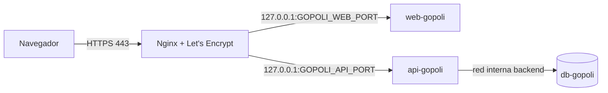

# **Despliegue de GoPoli en Producción con Docker**

Esta guía describe cómo desplegar el entorno **de producción** de GoPoli con Docker Compose en un servidor propio (VPS o máquina dedicada), detrás de Nginx con HTTPS.

---

## **Requisitos Previos**

* **Docker Engine** y **Docker Compose v2.20 o superior**: [Instrucciones de instalación](https://docs.docker.com/engine/install/)
* **Nginx** y **Certbot** en el servidor para publicar los dominios con HTTPS.
* Dos dominios (registros `A`) apuntando al servidor: uno para la API y otro para la PWA.

---

## **Arquitectura del Entorno**



| Servicio | Red | Puerto en el host | Descripción |
| --- | --- | --- | --- |
| `db-gopoli` | `backend` (interna, sin salida a internet) | Ninguno | PostgreSQL con esquema y catálogos; perfil `db` |
| `api-gopoli` | `backend` + `frontend` | `127.0.0.1:${GOPOLI_API_PORT}` | API REST |
| `web-gopoli` | `frontend` | `127.0.0.1:${GOPOLI_WEB_PORT}` | PWA |

Los puertos solo escuchan en `127.0.0.1`: el único punto de entrada público es Nginx. La base de datos no publica ningún puerto.

### Endurecimiento aplicado

| Medida | Dónde |
| --- | --- |
| Sistema de archivos de solo lectura con `tmpfs` para lo temporal | Los tres servicios |
| Sin capacidades de Linux (`cap_drop: ALL`) y `no-new-privileges` | Los tres servicios |
| Usuarios sin privilegios (UID 70, 10001 y 1000) | Imágenes |
| Límites de CPU y memoria, `ulimits` y rotación de logs (10 MB × 3) | Los tres servicios |
| Red `backend` interna: la base no es accesible desde fuera ni tiene salida | `db-gopoli` |
| Healthchecks y arranque ordenado (`depends_on: service_healthy`) | Los tres servicios |
| Imágenes con SBOM y atestación de procedencia | GHCR |

---

## **Archivos Requeridos**

| Archivo | Contenido |
| --- | --- |
| `docker-compose.yml` | Definición de servicios |
| `.env` | Perfiles, puertos del host y etiquetas de imagen |
| `.env.db` | Credenciales de PostgreSQL |
| `.env.api` | Conexión a la base, secreto JWT y CORS |
| `.env.web` | URL pública de la API |
| `update_gopoli.sh` | Actualiza compose e imágenes y verifica la salud |
| `backup_gopoli.sh` | Respaldo de la base con `pg_dump` |

```bash
mkdir -p gopoli/production && cd gopoli/production
base=https://raw.githubusercontent.com/GoPoli/.github/main/docker/production
for f in docker-compose.yml update_gopoli.sh backup_gopoli.sh; do curl -fsSL $base/$f -o $f; done
curl -fsSL $base/.env.example -o .env
curl -fsSL $base/.env.db.example -o .env.db
curl -fsSL $base/.env.api.example -o .env.api
curl -fsSL $base/.env.web.example -o .env.web
chmod 700 update_gopoli.sh backup_gopoli.sh
chmod 600 .env .env.db .env.api .env.web
```

### Variables

| Archivo | Variable | Valor |
| --- | --- | --- |
| `.env` | `COMPOSE_PROFILES` | `db` para usar la base incluida; vacío si la base es externa |
| `.env` | `GOPOLI_API_PORT` / `GOPOLI_WEB_PORT` | Puertos libres del host para la API y la PWA |
| `.env` | `GOPOLI_*_TAG` | `latest`, `sha-<commit>` o `X.Y.Z` |
| `.env.db` | `POSTGRES_PASSWORD` | Contraseña propia (`openssl rand -hex 24`) |
| `.env.db` | `GOPOLI_SEED_DEMO` | `false` |
| `.env.api` | `SPRING_DATASOURCE_PASSWORD` | La misma de `.env.db` |
| `.env.api` | `GOPOLI_JWT_SECRET` | Secreto propio (`openssl rand -base64 48`) |
| `.env.api` | `CORS_ALLOWED_ORIGINS` | Dominio público de la PWA, por ejemplo `https://app.tu-dominio` |
| `.env.web` | `NEXT_PUBLIC_API_URL` | Dominio público de la API, por ejemplo `https://api.tu-dominio` |

Para ver qué puertos están ocupados en el servidor:

```bash
ss -ltn | awk 'NR>1 {print $4}' | awk -F: '{print $NF}' | sort -n | uniq
```

> [!IMPORTANT]
> Nunca reutilices en producción el secreto JWT ni las contraseñas de los entornos demo o dev, y nunca actives `GOPOLI_SEED_DEMO`: crea cuentas con una contraseña pública.

### Base externa (Neon u otro proveedor)

Deja `COMPOSE_PROFILES` vacío en `.env` y apunta `SPRING_DATASOURCE_*` en `.env.api` a la base externa (URL JDBC con `?sslmode=require`). El esquema se crea con los scripts de [GoPoli-DB](https://github.com/GoPoli/GoPoli-DB/blob/main/docs/DATABASE_NEON.md).

---

## **Ejecución**

```bash
docker compose -p gopoli up -d
docker compose -p gopoli ps
```

La primera vez, PostgreSQL crea el esquema y carga los catálogos antes de reportarse `healthy`; luego arrancan la API y la PWA.

Actualizar a la última versión publicada:

```bash
./update_gopoli.sh
```

El script descarga el `docker-compose.yml` publicado, lo valida con tus `.env`, descarga las imágenes, recrea los contenedores y falla si la API o la PWA no quedan `healthy`.

Detener sin borrar datos:

```bash
docker compose -p gopoli down
```

> [!CAUTION]
> `docker compose down -v` borra el volumen `pg_data` y con él todos los usuarios, viajes y mensajes.

---

## **Respaldos**

```bash
./backup_gopoli.sh
```

Genera `backups/gopoli-<fecha>.dump` (formato custom de `pg_dump`, permisos `600`) y elimina los respaldos con más de 14 días (`GOPOLI_BACKUP_DAYS`). Para programarlo cada noche:

```bash
( crontab -l 2>/dev/null; echo "30 3 * * * $(pwd)/backup_gopoli.sh >> $(pwd)/backups/backup.log 2>&1" ) | crontab -
```

Restaurar un respaldo:

```bash
docker exec -i gopoli-db sh -c 'pg_restore --clean --if-exists -U "$POSTGRES_USER" -d "$POSTGRES_DB"' < backups/gopoli-<fecha>.dump
```

---

## **Nginx y HTTPS**

Un archivo por dominio en `/etc/nginx/sites-available/`, enlazado en `sites-enabled/`. Ejemplo para la API (la PWA es igual con su dominio y `GOPOLI_WEB_PORT`):

```nginx
server {
    listen 80;
    server_name api.tu-dominio;

    client_max_body_size 5m;

    location / {
        proxy_pass http://127.0.0.1:8080;
        proxy_http_version 1.1;
        proxy_set_header Host $host;
        proxy_set_header X-Real-IP $remote_addr;
        proxy_set_header X-Forwarded-For $proxy_add_x_forwarded_for;
        proxy_set_header X-Forwarded-Proto $scheme;
        proxy_read_timeout 60s;
    }
}
```

`client_max_body_size` permite subir la foto de perfil, que viaja en base64 dentro del JSON.

```bash
ln -s /etc/nginx/sites-available/api.tu-dominio /etc/nginx/sites-enabled/
nginx -t && systemctl reload nginx
certbot --nginx -d api.tu-dominio -d app.tu-dominio --redirect
nginx -t && systemctl reload nginx
```

Certbot añade el bloque `listen 443 ssl`, los certificados y la redirección de HTTP a HTTPS, y renueva los certificados automáticamente. La PWA necesita HTTPS para registrar el service worker y poder instalarse.

---

## **Verificación**

```bash
curl -fsS https://api.tu-dominio/health
curl -fsS https://api.tu-dominio/programs
curl -s -o /dev/null -w "%{http_code}\n" https://api.tu-dominio/trips/active
curl -sI https://app.tu-dominio/login
```

| Comprobación | Resultado esperado |
| --- | --- |
| `/health` | `{"status":"UP","database":"UP"}` |
| `/programs` | Lista de carreras |
| `/trips/active` sin token | `401` |
| `/login` de la PWA | `200` con cabeceras `X-Frame-Options`, `X-Content-Type-Options` y `Referrer-Policy` |
