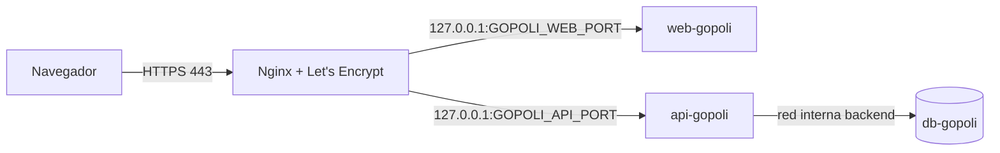
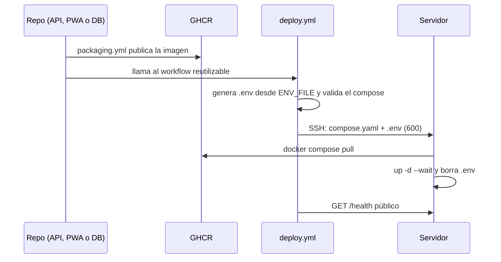

# **Despliegue de GoPoli en Producción con Docker**

Esta guía describe el entorno **de producción** de GoPoli: un servidor propio (VPS o máquina dedicada) detrás de Nginx con HTTPS, actualizado automáticamente por GitHub Actions cada vez que cambia `main` en la API, la PWA o la base de datos.

---

## **Requisitos Previos**

* **Docker Engine** y **Docker Compose v2.20 o superior** en el servidor: [Instrucciones de instalación](https://docs.docker.com/engine/install/)
* Un usuario SSH con acceso a Docker (`root` o con `sudo` sin contraseña).
* **Nginx** y **Certbot** para publicar los dominios con HTTPS.
* Dos dominios (registros `A`) apuntando al servidor: uno para la API y otro para la PWA.

---

## **Arquitectura del Entorno**



| Servicio | Red | Puerto en el host | Variables que recibe |
| --- | --- | --- | --- |
| `db-gopoli` | `backend` (interna, sin salida a internet) | Ninguno | `POSTGRES_*`, `GOPOLI_SEED_DEMO` |
| `api-gopoli` | `backend` + `frontend` | `127.0.0.1:${GOPOLI_API_PORT}` | Conexión a la base, JWT, CORS, zona horaria |
| `web-gopoli` | `frontend` | `127.0.0.1:${GOPOLI_WEB_PORT}` | `NEXT_PUBLIC_API_URL` |

Toda la configuración vive en un único `.env`, pero `compose.yaml` entrega a cada contenedor solo sus variables: la PWA nunca ve el secreto JWT ni la contraseña de la base. `db-gopoli` pertenece al perfil `db`; con una base externa como Neon basta con dejar `COMPOSE_PROFILES` vacío.

### Endurecimiento aplicado

| Medida | Dónde |
| --- | --- |
| Sistema de archivos de solo lectura con `tmpfs` para lo temporal | Los tres servicios |
| Sin capacidades de Linux (`cap_drop: ALL`) y `no-new-privileges` | Los tres servicios |
| Usuarios sin privilegios (UID 70, 10001 y 1000) | Imágenes |
| Límites de CPU y memoria, `ulimits` y rotación de logs (10 MB × 3) | Los tres servicios |
| Red `backend` interna: la base no es accesible desde fuera ni tiene salida | `db-gopoli` |
| Healthchecks y arranque ordenado (`depends_on: service_healthy`) | Los tres servicios |
| `.env` solo durante el despliegue; en el servidor queda únicamente `compose.yaml` | Workflow de despliegue |
| Imágenes con SBOM y atestación de procedencia | GHCR |

---

## **Despliegue Automático (GitHub Actions)**



El workflow [`deploy.yml`](../../.github/workflows/deploy.yml) se ejecuta:

* Al final de `packaging.yml` en GoPoli-API, GoPoli-Web y GoPoli-DB, cuando el push es a `main`.
* Cuando cambia `docker/production/compose.yaml` en este repositorio.
* A mano, desde **Actions → Deploy to Production → Run workflow**.

Si falta algún secret, el despliegue se omite con un aviso en lugar de fallar.

### Secrets

Se crean en **Organization settings → Secrets and variables → Actions** con acceso para `.github`, `GoPoli-API`, `GoPoli-Web` y `GoPoli-DB`, o en **Settings → Secrets and variables → Actions** de cada uno de esos repositorios (`gh secret set <NOMBRE> --repo GoPoli/<repo>`):

| Secret | Ejemplo | Descripción |
| --- | --- | --- |
| `SERVER_HOST` | `203.0.113.10` | IP o dominio del servidor |
| `SERVER_PORT` | `22` | Puerto SSH |
| `SERVER_USER` | `deploy` | Usuario SSH (`root` o con `sudo` sin contraseña) |
| `SERVER_KEY` | `-----BEGIN … PRIVATE KEY-----` | Llave privada SSH completa |
| `SERVER_KNOWN_HOSTS` | `[203.0.113.10]:22 ssh-ed25519 AAAA…` | Huella del servidor; evita confiar a ciegas en `ssh-keyscan` |
| `DEPLOY_PATH` | `/srv/gopoli/production` | Carpeta de despliegue |
| `ENV_FILE` | Contenido de [`.env.example`](.env.example) | `.env` completo de producción |

Con GitHub CLI (requiere el scope `admin:org`):

```bash
repos=.github,GoPoli-API,GoPoli-Web,GoPoli-DB
gh secret set SERVER_KEY --org GoPoli --visibility selected --repos "$repos" < ~/.ssh/deploy_key
gh secret set ENV_FILE --org GoPoli --visibility selected --repos "$repos" < .env.production
ssh-keyscan -p 22 203.0.113.10 | gh secret set SERVER_KNOWN_HOSTS --org GoPoli --visibility selected --repos "$repos"
```

> [!IMPORTANT]
> Usa una llave SSH dedicada al despliegue, genera contraseñas y secretos propios (`openssl rand -hex 24`, `openssl rand -base64 48`) y nunca actives `GOPOLI_SEED_DEMO` en producción. Si la base ya existe, `POSTGRES_PASSWORD` y `SPRING_DATASOURCE_PASSWORD` deben ser la contraseña con la que se inicializó.

### Variables de `ENV_FILE`

| Variable | Valor |
| --- | --- |
| `COMPOSE_PROFILES` | `db` para usar la base incluida; vacío si la base es externa |
| `GOPOLI_API_PORT` / `GOPOLI_WEB_PORT` | Puertos libres del host para la API y la PWA |
| `GOPOLI_*_TAG` | `latest`, `sha-<commit>` o `X.Y.Z` |
| `POSTGRES_PASSWORD` / `SPRING_DATASOURCE_PASSWORD` | Contraseña de la base (la misma en ambas) |
| `GOPOLI_JWT_SECRET` | Secreto de al menos 32 caracteres |
| `CORS_ALLOWED_ORIGINS` | Dominio público de la PWA, por ejemplo `https://app.tu-dominio` |
| `NEXT_PUBLIC_API_URL` | Dominio público de la API, por ejemplo `https://api.tu-dominio` |

Para ver qué puertos están ocupados en el servidor:

```bash
ss -ltn | awk 'NR>1 {print $4}' | awk -F: '{print $NF}' | sort -n | uniq
```

### Operación

Los contenedores conservan su configuración aunque el `.env` se borre, porque Docker la guarda al crearlos; `docker compose ps`, `logs` y `restart` funcionan sin él. En cambio, **no ejecutes `docker compose up` a mano en el servidor**: sin `.env` recrearía los contenedores sin secretos. Para cambiar la configuración edita el secret `ENV_FILE` y ejecuta **Deploy to Production**.

```bash
cd <DEPLOY_PATH>
docker compose ps
docker compose logs -f api-gopoli
```

> [!CAUTION]
> `docker compose down -v` borra el volumen `pg_data` y con él todos los usuarios, viajes y mensajes.

---

## **Despliegue Manual**

Sin GitHub Actions, el mismo `compose.yaml` funciona con un `.env` permanente junto a él:

```bash
mkdir -p gopoli/production && cd gopoli/production
base=https://raw.githubusercontent.com/GoPoli/.github/main/docker/production
curl -fsSL $base/compose.yaml -o compose.yaml
curl -fsSL $base/.env.example -o .env
chmod 600 .env
docker compose -p gopoli up -d --wait
```

Actualizar a la última versión publicada:

```bash
docker compose -p gopoli pull
docker compose -p gopoli up -d --wait
```

---

## **Respaldos**

[`backup_gopoli.sh`](backup_gopoli.sh) genera `backups/gopoli-<fecha>.dump` (formato custom de `pg_dump`, permisos `600`) junto al script y elimina los respaldos con más de 14 días (`GOPOLI_BACKUP_DAYS`). No necesita el `.env`: usa las credenciales del propio contenedor.

```bash
curl -fsSL https://raw.githubusercontent.com/GoPoli/.github/main/docker/production/backup_gopoli.sh -o backup_gopoli.sh
chmod 700 backup_gopoli.sh
./backup_gopoli.sh
```

Restaurar un respaldo:

```bash
docker exec -i gopoli-db sh -c 'pg_restore --clean --if-exists -U "$POSTGRES_USER" -d "$POSTGRES_DB"' < backups/gopoli-<fecha>.dump
```

---

## **Nginx y HTTPS**

Un archivo por dominio en `/etc/nginx/sites-available/`, enlazado en `sites-enabled/`. Ejemplo para la API (la PWA es igual con su dominio y `GOPOLI_WEB_PORT`):

```nginx
server {
    listen 80;
    server_name api.tu-dominio;

    client_max_body_size 5m;

    location / {
        proxy_pass http://127.0.0.1:8080;
        proxy_http_version 1.1;
        proxy_set_header Host $host;
        proxy_set_header X-Real-IP $remote_addr;
        proxy_set_header X-Forwarded-For $proxy_add_x_forwarded_for;
        proxy_set_header X-Forwarded-Proto $scheme;
        proxy_read_timeout 60s;
    }
}
```

`client_max_body_size` permite subir la foto de perfil, que viaja en base64 dentro del JSON.

```bash
ln -s /etc/nginx/sites-available/api.tu-dominio /etc/nginx/sites-enabled/
nginx -t && systemctl reload nginx
certbot --nginx -d api.tu-dominio --redirect --hsts
certbot --nginx -d app.tu-dominio --redirect --hsts
nginx -t && systemctl reload nginx
```

Certbot añade el bloque `listen 443 ssl`, los certificados, la redirección de HTTP a HTTPS y la cabecera HSTS, y renueva los certificados automáticamente. La PWA necesita HTTPS para registrar el service worker y poder instalarse.

---

## **Verificación**

```bash
curl -fsS https://api.tu-dominio/health
curl -fsS https://api.tu-dominio/programs
curl -s -o /dev/null -w "%{http_code}\n" https://api.tu-dominio/trips/active
curl -sI https://app.tu-dominio/login
```

| Comprobación | Resultado esperado |
| --- | --- |
| `/health` | `{"status":"UP","database":"UP"}` |
| `/programs` | Lista de carreras |
| `/trips/active` sin token | `401` |
| `/login` de la PWA | `200` con cabeceras `X-Frame-Options`, `X-Content-Type-Options` y `Referrer-Policy` |
