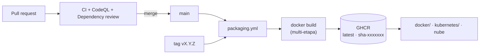
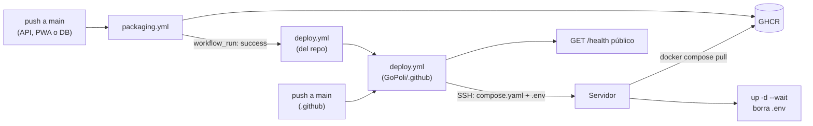

# CI/CD y GitHub Container Registry

Cada repositorio de GoPoli es independiente: tiene su propio pipeline, sus propias pruebas y publica su propia imagen en **GitHub Container Registry (GHCR)**. Esta guía explica cómo funciona y qué configurar en la organización.

---

## Pipelines por repositorio

| Repositorio | Workflow | Disparador | Qué hace |
| --- | --- | --- | --- |
| GoPoli-API | `maven.yml` | Push y PR a `main` | `mvn verify`: compila y ejecuta las pruebas |
| GoPoli-API | `codeql.yml` | Push, PR y semanal | Análisis de seguridad de Java y Actions |
| GoPoli-API | `dependency-review.yml` | PR a `main` | Revisa vulnerabilidades en dependencias nuevas |
| GoPoli-API | `packaging.yml` | Push a `main`, tags, manual | Publica `ghcr.io/gopoli/gopoli-api` |
| GoPoli-API | `deploy.yml` | Publicación exitosa en `main`, manual | Despliega la app completa |
| GoPoli-API | `stale.yml` | Diario | Marca y cierra issues y PRs inactivos |
| GoPoli-Web | `node.js.yml` | Push y PR a `main` | `pnpm install --frozen-lockfile`, lint, typecheck, pruebas y build en Node 22 y 24 |
| GoPoli-Web | `codeql.yml` | Push, PR y semanal | Análisis de seguridad de TypeScript y Actions |
| GoPoli-Web | `dependency-review.yml` | PR a `main` | Revisa vulnerabilidades en dependencias nuevas |
| GoPoli-Web | `packaging.yml` | Push a `main`, tags, manual | Publica `ghcr.io/gopoli/gopoli-web` |
| GoPoli-Web | `deploy.yml` | Publicación exitosa en `main`, manual | Despliega la app completa |
| GoPoli-Web | `stale.yml` | Diario | Marca y cierra issues y PRs inactivos |
| GoPoli-DB | `ci.yml` | Push y PR a `main` | Construye la imagen, la arranca endurecida con y sin datos demo y valida tablas, catálogos y cuentas |
| GoPoli-DB | `packaging.yml` | Push a `main`, tags, manual | Publica `ghcr.io/gopoli/gopoli-db` |
| GoPoli-DB | `deploy.yml` | Publicación exitosa en `main`, manual | Despliega la app completa |
| .github | `deploy.yml` | Push a `main`, llamado desde el `deploy.yml` de cada repo, manual | Despliega el stack de producción por SSH |
| GoPoli-Mobile | `flutter.yml` | Push y PR a `main` | `flutter analyze` y `flutter test` (repositorio archivado) |

Además, **Dependabot** revisa cada semana las dependencias (Maven, pnpm mediante el ecosistema `npm`, o pub), la imagen base del `Dockerfile` y las versiones de las Actions de cada repositorio.

---

## Flujo de publicación



`packaging.yml` usa el `Dockerfile` del repositorio, por lo que la imagen publicada es exactamente la que se construye en local. Cada imagen se publica con su **SBOM** y una **atestación de procedencia** (`provenance: mode=max`), visibles en GHCR. La autenticación con GHCR usa el `GITHUB_TOKEN` del workflow: **no hay que configurar secretos**.

### Etiquetas

| Evento | Etiquetas publicadas |
| --- | --- |
| Push a `main` | `latest`, `sha-<commit>` |
| Tag `v1.4.2` | `1.4.2`, `1.4`, `sha-<commit>` |
| Ejecución manual | `latest` (si es `main`), `sha-<commit>` |

Para publicar una versión:

```bash
git tag v1.0.0
git push origin v1.0.0
```

---

## Configuración de la organización

Pasos a realizar una vez que los repositorios estén en GitHub.

### 1. Permisos de Actions

**Organization settings → Actions → General**

- *Actions permissions*: permitir las acciones de GitHub y de creadores verificados (usamos `actions/*`, `github/*` y `docker/*`).
- *Workflow permissions*: los workflows declaran sus propios permisos (`packages: write` solo en `packaging.yml`), así que el valor por defecto de solo lectura es suficiente.

### 2. Paquetes de GHCR

Después del primer push a `main` aparecerán tres paquetes en **GoPoli → Packages**. Para cada uno:

1. Abre el paquete → **Package settings**.
2. Verifica en *Manage Actions access* que el repositorio de origen tenga rol **Write** (se asigna solo al publicar desde su workflow).
3. En *Danger Zone* → **Change visibility** → **Public**, si quieres que cualquiera pueda descargar las imágenes sin autenticarse (necesario para la demo de un solo comando).

> [!NOTE]
> Para permitir paquetes públicos, la organización debe tenerlo habilitado en **Organization settings → Packages → Package creation**.

### 3. Protección de la rama `main`

**Repository settings → Rules → Rulesets** en cada repositorio:

- Requerir pull request antes de integrar, con al menos una aprobación.
- Requerir que pasen los checks de estado:
  - GoPoli-API: `Build and Test`
  - GoPoli-Web: `Build and Test (Node 22.x)`
  - GoPoli-DB: `Build and Validate Image (demo=false)` y `Build and Validate Image (demo=true)`
- Bloquear force pushes.

Así `packaging.yml` solo publica código que ya pasó la CI.

### 4. Seguridad del código

**Repository settings → Code security** en cada repositorio:

- Activar *Dependency graph*, *Dependabot alerts* y *Dependabot security updates*.
- Activar *Private vulnerability reporting* para que funcione el flujo de [SECURITY.md](../SECURITY.md).
- CodeQL y la revisión de dependencias son gratuitos en repositorios públicos; en repositorios privados requieren GitHub Advanced Security.

---

## Archivos de comunidad compartidos

El repositorio especial `.github` aporta a toda la organización:

| Archivo | Efecto |
| --- | --- |
| `profile/README.md` | Página de presentación de la organización |
| `CODE_OF_CONDUCT.md`, `CONTRIBUTING.md`, `SECURITY.md` | Se muestran en cada repositorio que no tenga los suyos |
| `.github/ISSUE_TEMPLATE/` | Plantillas de issues por defecto |
| `.github/PULL_REQUEST_TEMPLATE.md` | Plantilla de pull request por defecto |

Si un repositorio define su propio archivo con el mismo nombre, ese tiene prioridad.

---

## Publicación manual (emergencias)

Si GitHub Actions no está disponible:

```bash
echo $GHCR_TOKEN | docker login ghcr.io -u <usuario> --password-stdin
docker build --platform linux/amd64 -t ghcr.io/gopoli/gopoli-api:latest .
docker push ghcr.io/gopoli/gopoli-api:latest
```

`GHCR_TOKEN` es un token personal (classic) con el permiso `write:packages`, o un token *fine-grained* con acceso de escritura a los paquetes de la organización.

---

## Despliegue en el servidor

El despliegue es continuo y siempre es de la app completa. Cada repositorio de componente tiene su propio `deploy.yml`, que se dispara cuando `packaging.yml` termina bien en `main` y llama al workflow reutilizable [`deploy.yml`](../.github/workflows/deploy.yml) de este repositorio. Ese workflow actualiza por SSH la base, la API y la PWA a la vez. En este repositorio, cualquier push a `main` también despliega.



| Paso | Qué hace |
| --- | --- |
| Verificación | Si faltan secrets, el despliegue se omite con un aviso en lugar de fallar |
| `.env` temporal | Se genera desde el secret `ENV_FILE`, se validan las variables obligatorias y el compose con `docker compose config` |
| SSH | Llave desde `SERVER_KEY` y huella del servidor fijada con `SERVER_KNOWN_HOSTS` (`StrictHostKeyChecking yes`) |
| Transferencia | `compose.yaml` y `.env` viajan comprimidos por SSH a una carpeta temporal propia de la ejecución (`DEPLOY_PATH/.deploy-<id>`, permisos `700`) |
| Despliegue | Con el turno de `flock` tomado copia su `compose.yaml` y su `.env` a `DEPLOY_PATH`, ejecuta `docker compose pull`, `up -d --remove-orphans --wait` e `image prune`; los despliegues simultáneos de varios repos esperan en fila |
| Limpieza | Una `trap` borra el `.env` y la carpeta temporal antes de soltar el turno, aunque el despliegue falle; en el servidor queda solo `compose.yaml` |
| Protección | Los secretos son obligatorios en `compose.yaml`: un `docker compose up` sin `.env` falla en lugar de recrear servicios sin secretos |
| Verificación pública | `GET {NEXT_PUBLIC_API_URL}/health` debe responder antes de dar el despliegue por bueno |

Los contenedores conservan su configuración después de borrar el `.env`: Docker la guarda al crearlos. Por eso en el servidor no se ejecuta `docker compose up` a mano; cualquier cambio de configuración se hace editando el secret `ENV_FILE` y ejecutando de nuevo **Deploy to Production**.

### Secrets de la organización

| Secret | Contenido |
| --- | --- |
| `SERVER_HOST` | IP o dominio del servidor |
| `SERVER_PORT` | Puerto SSH |
| `SERVER_USER` | Usuario SSH (con `sudo` sin contraseña o `root`) |
| `SERVER_KEY` | Llave privada SSH en formato PEM u OpenSSH |
| `SERVER_KNOWN_HOSTS` | Línea de `known_hosts` del servidor (`ssh-keyscan -p <puerto> <host>`) |
| `DEPLOY_PATH` | Carpeta de despliegue en el servidor |
| `ENV_FILE` | Contenido completo del `.env` de producción ([plantilla](../docker/production/.env.example)) |

Se definen a nivel de organización (con acceso para `.github`, `GoPoli-API`, `GoPoli-Web` y `GoPoli-DB`) o en cada uno de esos cuatro repositorios; el `deploy.yml` de cada repo los pasa al workflow reutilizable con `secrets: inherit`. Los pull requests desde forks nunca reciben secrets.

Para fijar versiones, define `GOPOLI_API_TAG`, `GOPOLI_WEB_TAG` y `GOPOLI_DB_TAG` en `ENV_FILE` con una etiqueta `sha-<commit>` o `X.Y.Z`; revertir es volver a la etiqueta anterior y ejecutar el workflow. Guía completa: [docker/production](../docker/production/README.md).
