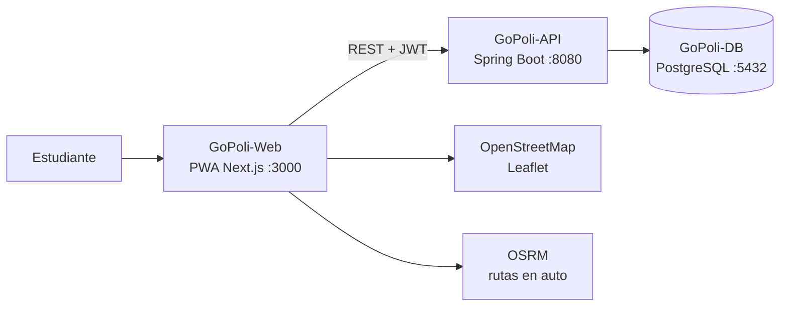

# Manual de Instalación de GoPoli

Este manual reúne todas las formas de ejecutar GoPoli, desde la demo de un solo comando hasta el despliegue en la nube. Cada componente tiene además su propia guía en su repositorio.

---

## Componentes



| Componente | Repositorio | Imagen |
| --- | --- | --- |
| Base de datos | [GoPoli-DB](https://github.com/GoPoli/GoPoli-DB) | `ghcr.io/gopoli/gopoli-db` |
| API | [GoPoli-API](https://github.com/GoPoli/GoPoli-API) | `ghcr.io/gopoli/gopoli-api` |
| PWA | [GoPoli-Web](https://github.com/GoPoli/GoPoli-Web) | `ghcr.io/gopoli/gopoli-web` |

---

## Elegir un método

| Método | Para quién | Requisitos |
| --- | --- | --- |
| [A. Demo con Docker](#a-demo-con-docker) | Probar GoPoli en minutos | Docker |
| [B. Desarrollo local](#b-desarrollo-local) | Programar en uno o varios componentes | Docker, Java 17, Node.js 22 |
| [C. Kubernetes](#c-kubernetes) | Practicar orquestación | Minikube o Docker Desktop con Kubernetes, kubectl |
| [D. Nube](#d-nube) | Publicar GoPoli | Cuentas en Neon y en un host de contenedores |

---

## A. Demo con Docker

```bash
curl -L https://raw.githubusercontent.com/GoPoli/.github/main/docker/demo/docker-compose.yml -o docker-compose.yml
docker compose -p gopoli up -d
```

| Servicio | URL |
| --- | --- |
| PWA | [http://localhost:3000](http://localhost:3000) |
| API | [http://localhost:8080/ubicaciones](http://localhost:8080/ubicaciones) |
| PostgreSQL | `localhost:5432` (`gopoli` / `gopoli`) |

Usuario demo: `demo.local@elpoli.edu.co` / `gopoli-local-dev`.

Guía completa: [docker/demo](../docker/demo/README.md). Para configurar cada servicio con su propio `.env`, usa [docker/dev](../docker/dev/README.md).

---

## B. Desarrollo local

### Requisitos

| Herramienta | Versión | Para |
| --- | --- | --- |
| Git | 2.40+ | Clonar los repositorios |
| Docker | 24+ con Compose v2 | Base de datos |
| Java | 17 (Temurin recomendado) | API |
| Node.js | 22+ | PWA |

### 1. Clonar los repositorios

```bash
mkdir GoPoli && cd GoPoli
git clone https://github.com/GoPoli/GoPoli-DB.git
git clone https://github.com/GoPoli/GoPoli-API.git
git clone https://github.com/GoPoli/GoPoli-Web.git
```

### 2. Base de datos

```bash
cd GoPoli-DB
cp .env.example .env
docker compose up -d --build
cd ..
```

### 3. API

```bash
cd GoPoli-API
./mvnw spring-boot:run
```

En Windows: `mvnw.cmd spring-boot:run`. Sin variables, la API usa `localhost:5432/gopoli` con `gopoli` / `gopoli`. Verifica con `curl http://localhost:8080/carreras`.

### 4. PWA

En otra terminal:

```bash
cd GoPoli-Web
cp .env.example .env.local
npm install
npm run dev
```

Abre [http://localhost:3000](http://localhost:3000).

### Trabajar en un solo componente

No hace falta ejecutar todo desde código. Por ejemplo, para trabajar solo en la PWA, levanta la base y la API con las imágenes publicadas usando el entorno [docker/dev](../docker/dev/README.md) (con sus archivos `.env` configurados):

```bash
docker compose -p gopoli up -d db-gopoli api-gopoli
```

y ejecuta `npm run dev` en GoPoli-Web.

---

## C. Kubernetes

```bash
minikube start
kubectl apply -f https://raw.githubusercontent.com/GoPoli/.github/main/kubernetes/k8s-deployment.yml
kubectl -n gopoli get pods -w
kubectl -n gopoli port-forward svc/api-gopoli 8080:8080
kubectl -n gopoli port-forward svc/web-gopoli 3000:3000
```

Guía completa: [kubernetes](../kubernetes/README.md).

---

## D. Nube

Arquitectura recomendada:

```text
GitHub (GoPoli)
├── GHCR                 imágenes de API, PWA y DB publicadas por GitHub Actions
├── Neon                 PostgreSQL gestionado
├── Railway / VPS        API  (ghcr.io/gopoli/gopoli-api)
└── Railway / VPS        PWA  (ghcr.io/gopoli/gopoli-web) con HTTPS
```

1. **Base de datos:** crea el proyecto en Neon y carga el esquema. Guía: [GoPoli-DB · Neon](https://github.com/GoPoli/GoPoli-DB/blob/main/docs/DATABASE_NEON.md).
2. **API:** despliega la imagen con las variables `SPRING_DATASOURCE_*` y `GOPOLI_JWT_SECRET`. Guía: [GoPoli-API · Railway](https://github.com/GoPoli/GoPoli-API/blob/main/docs/DEPLOY_RAILWAY.md).
3. **PWA:** despliega la imagen con `NEXT_PUBLIC_API_URL` apuntando al dominio público de la API. Guía: [GoPoli-Web · Despliegue](https://github.com/GoPoli/GoPoli-Web/blob/main/docs/DEPLOYMENT.md).
4. **Servidor propio:** usa [docker/production](../docker/production/README.md) detrás de un proxy reverso con HTTPS.

---

## Verificación

```bash
curl http://localhost:8080/carreras
curl http://localhost:8080/ubicaciones
curl -X POST http://localhost:8080/login \
  -H "Content-Type: application/json" \
  -d '{"correo":"demo.local@elpoli.edu.co","contrasena":"gopoli-local-dev"}'
```

La última llamada devuelve un `token`. Con él, `GET /usuario/me` con `Authorization: Bearer <token>` devuelve el perfil del usuario demo.

---

## Problemas comunes

| Síntoma | Causa | Solución |
| --- | --- | --- |
| `port is already allocated` en 5432 | Otro PostgreSQL en el equipo | Detén ese servicio o cambia el mapeo a `"5433:5432"` y ajusta `SPRING_DATASOURCE_URL` |
| La API falla con `WeakKeyException` | `GOPOLI_JWT_SECRET` con menos de 32 caracteres | Usa un secreto más largo (`openssl rand -base64 48`) |
| La API no conecta con Neon | Falta `?sslmode=require` o se usó la URL `postgres://` | Usa formato JDBC con `sslmode=require` y el host con pooler |
| La PWA carga pero no inicia sesión | `NEXT_PUBLIC_API_URL` apunta a `api-gopoli` o a un puerto incorrecto | Usa una URL que resuelva el navegador (`http://localhost:8080` o el dominio público) |
| Los cambios de `init/` no se aplican | Los scripts solo corren con el volumen vacío | `docker compose down -v` y volver a levantar |
| `denied` al descargar imágenes de GHCR | Paquetes privados | `docker login ghcr.io` con un token `read:packages` o hacer públicos los paquetes |
| La PWA no se instala | Falta HTTPS | Publica la PWA con HTTPS (localhost está exento) |
