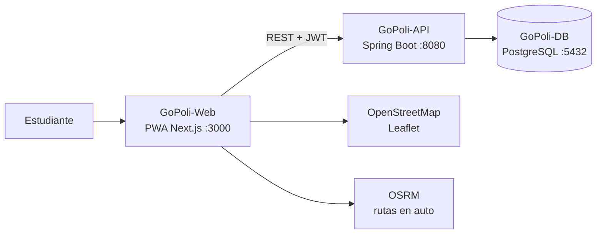

# Manual de Instalación de GoPoli

Este manual reúne todas las formas de ejecutar GoPoli, desde la demo de un solo comando hasta el despliegue en la nube. Cada componente tiene además su propia guía en su repositorio.

---

## Componentes



| Componente | Repositorio | Imagen |
| --- | --- | --- |
| Base de datos | [GoPoli-DB](https://github.com/GoPoli/GoPoli-DB) | `ghcr.io/gopoli/gopoli-db` |
| API | [GoPoli-API](https://github.com/GoPoli/GoPoli-API) | `ghcr.io/gopoli/gopoli-api` |
| PWA | [GoPoli-Web](https://github.com/GoPoli/GoPoli-Web) | `ghcr.io/gopoli/gopoli-web` |
| App móvil (archivada) | [GoPoli-Mobile](https://github.com/GoPoli/GoPoli-Mobile) | — |

---

## Elegir un método

| Método | Para quién | Requisitos |
| --- | --- | --- |
| [A. Demo con Docker](#a-demo-con-docker) | Probar GoPoli en minutos | Docker |
| [B. Desarrollo local](#b-desarrollo-local) | Programar en uno o varios componentes | Docker, Java 17, Node.js 22, pnpm |
| [C. Kubernetes](#c-kubernetes) | Practicar orquestación | Docker Desktop con Kubernetes o Minikube, kubectl |
| [D. Servidor propio](#d-servidor-propio) | Publicar GoPoli con dominio y HTTPS | VPS con Docker, Nginx y Certbot |
| [E. Nube gestionada](#e-nube-gestionada) | Publicar sin administrar servidores | Cuentas en Neon y en un host de contenedores |

---

## A. Demo con Docker

```bash
mkdir gopoli-demo && cd gopoli-demo
curl -L https://raw.githubusercontent.com/GoPoli/.github/main/docker/demo/compose.yaml -o compose.yaml
docker compose up -d
```

| Servicio | URL |
| --- | --- |
| PWA | [http://localhost:3000](http://localhost:3000) |
| API | [http://localhost:8080/health](http://localhost:8080/health) |
| PostgreSQL | `localhost:5432` (`gopoli` / `gopoli`) |

Cuentas de demostración (contraseña `gopoli-local-dev`): `demo.local@elpoli.edu.co` (pasajera), `conductor.demo@elpoli.edu.co` (conductor con viaje activo) y `pasajera.demo@elpoli.edu.co`.

Guía completa: [docker/demo](../docker/demo/README.md). Para configurar cada servicio con su propio `.env`, usa [docker/dev](../docker/dev/README.md).

---

## B. Desarrollo local

### Requisitos

| Herramienta | Versión | Para |
| --- | --- | --- |
| Git | 2.40+ | Clonar los repositorios |
| Docker | 24+ con Compose v2 | Base de datos |
| Java | 17 (Temurin recomendado) | API |
| Node.js | 22+ | PWA |
| pnpm | 11 (vía `corepack enable`) | Dependencias de la PWA |

### 1. Clonar los repositorios

```bash
mkdir GoPoli && cd GoPoli
git clone https://github.com/GoPoli/GoPoli-DB.git
git clone https://github.com/GoPoli/GoPoli-API.git
git clone https://github.com/GoPoli/GoPoli-Web.git
```

### 2. Base de datos

```bash
cd GoPoli-DB
cp .env.example .env
docker compose up -d --build
cd ..
```

Define `POSTGRES_PASSWORD` en `.env`. Con `GOPOLI_SEED_DEMO=true` (valor del ejemplo) se crean las cuentas de demostración.

### 3. API

```bash
cd GoPoli-API
cp .env.example .env
./mvnw spring-boot:run
```

En Windows: `mvnw.cmd spring-boot:run`. La API lee `.env` al arrancar; define ahí `SPRING_DATASOURCE_PASSWORD` (la misma de GoPoli-DB) y `GOPOLI_JWT_SECRET`. Verifica con `curl http://localhost:8080/health`.

### 4. PWA

En otra terminal:

```bash
cd GoPoli-Web
cp .env.example .env
corepack enable
pnpm install
pnpm dev
```

Abre [http://localhost:3000](http://localhost:3000).

### Trabajar en un solo componente

No hace falta ejecutar todo desde código. Por ejemplo, para trabajar solo en la PWA, levanta la base y la API con las imágenes publicadas usando el entorno [docker/dev](../docker/dev/README.md) (con sus archivos `.env` configurados):

```bash
docker compose up -d db-gopoli api-gopoli
```

y ejecuta `pnpm dev` en GoPoli-Web.

---

## C. Kubernetes

```bash
kubectl apply -f https://raw.githubusercontent.com/GoPoli/.github/main/kubernetes/k8s-deployment.yml
kubectl -n gopoli rollout status deploy/api-gopoli --timeout=5m
```

En Docker Desktop la PWA queda en [http://localhost:30300](http://localhost:30300) y la API en [http://localhost:30080](http://localhost:30080/health). En Minikube usa `kubectl port-forward` con esos mismos puertos.

Guía completa: [kubernetes](../kubernetes/README.md).

---

## D. Servidor propio

Un VPS con Docker, Nginx y Certbot aloja los tres servicios con el entorno [docker/production](../docker/production/README.md):

1. Registra dos dominios (`A`) hacia el servidor: uno para la API y otro para la PWA.
2. Configura en la organización los secrets del despliegue (`SERVER_HOST`, `SERVER_PORT`, `SERVER_USER`, `SERVER_KEY`, `SERVER_KNOWN_HOSTS`, `DEPLOY_PATH` y `ENV_FILE`) con puertos libres del host en `GOPOLI_API_PORT` y `GOPOLI_WEB_PORT`.
3. Ejecuta el workflow **Deploy to Production** de este repositorio; desde entonces cada push a `main` de la API, la PWA o la base despliega solo.
4. Crea un sitio de Nginx por dominio hacia `127.0.0.1:<puerto>` y emite los certificados con `certbot --nginx`.

---

## E. Nube gestionada

Arquitectura recomendada:

```text
GitHub (GoPoli)
├── GHCR                 imágenes de API, PWA y DB publicadas por GitHub Actions
├── Neon                 PostgreSQL gestionado
├── Railway / VPS        API  (ghcr.io/gopoli/gopoli-api)
└── Railway / VPS        PWA  (ghcr.io/gopoli/gopoli-web) con HTTPS
```

1. **Base de datos:** crea el proyecto en Neon y carga el esquema. Guía: [GoPoli-DB · Neon](https://github.com/GoPoli/GoPoli-DB/blob/main/docs/DATABASE_NEON.md).
2. **API:** despliega la imagen con las variables `SPRING_DATASOURCE_*` y `GOPOLI_JWT_SECRET`. Guía: [GoPoli-API · Railway](https://github.com/GoPoli/GoPoli-API/blob/main/docs/DEPLOY_RAILWAY.md).
3. **PWA:** despliega la imagen con `NEXT_PUBLIC_API_URL` apuntando al dominio público de la API. Guía: [GoPoli-Web · Despliegue](https://github.com/GoPoli/GoPoli-Web/blob/main/docs/DEPLOYMENT.md).

---

## Verificación

```bash
curl http://localhost:8080/health
curl http://localhost:8080/programs
curl http://localhost:8080/locations
curl -X POST http://localhost:8080/login \
  -H "Content-Type: application/json" \
  -d '{"email":"demo.local@elpoli.edu.co","password":"gopoli-local-dev"}'
```

La última llamada devuelve `{"token": "...", "user": {...}}`. Con el token, `GET /users/me` con `Authorization: Bearer <token>` devuelve el perfil de la cuenta demo.

---

## Problemas comunes

| Síntoma | Causa | Solución |
| --- | --- | --- |
| `port is already allocated` en 5432 | Otro PostgreSQL en el equipo | Detén ese servicio o usa `DB_HOST_PORT=5433` en GoPoli-DB y ajusta `SPRING_DATASOURCE_URL` |
| La API se detiene con `Schema-validation` | La base no tiene el esquema actual | Recrea la base desde GoPoli-DB (`docker compose down -v`) o aplica `init/01_schema.sql` |
| `403 Invalid CORS request` | El origen de la PWA no está en `CORS_ALLOWED_ORIGINS` | Añade la URL exacta de la PWA (esquema, dominio y puerto) |
| No existen las cuentas demo | La base se creó con `GOPOLI_SEED_DEMO=false` | Recrea el volumen con `GOPOLI_SEED_DEMO=true` |
| La API falla con `WeakKeyException` | `GOPOLI_JWT_SECRET` con menos de 32 caracteres | Usa un secreto más largo (`openssl rand -base64 48`) |
| La API no conecta con Neon | Falta `?sslmode=require` o se usó la URL `postgres://` | Usa formato JDBC con `sslmode=require` y el host con pooler |
| La PWA carga pero no inicia sesión | `NEXT_PUBLIC_API_URL` apunta a `api-gopoli` o a un puerto incorrecto | Usa una URL que resuelva el navegador (`http://localhost:8080` o el dominio público) |
| La API queda `unhealthy` con `password authentication failed` en el log | El volumen de PostgreSQL ya existía con otra contraseña: la base solo toma `POSTGRES_PASSWORD` al crearse | Usa la contraseña original o recrea el volumen de ese entorno con `docker compose down -v` |
| `Found multiple config files` | Hay un `docker-compose.yml` viejo junto al `compose.yaml` | Ejecuta cada entorno en su propia carpeta o borra el archivo antiguo |
| Los cambios de `init/` no se aplican | Los scripts solo corren con el volumen vacío | `docker compose down -v` y volver a levantar |
| `denied` al descargar imágenes de GHCR | Paquetes privados | `docker login ghcr.io` con un token `read:packages` o hacer públicos los paquetes |
| La PWA no se instala | Falta HTTPS | Publica la PWA con HTTPS (localhost está exento) |
