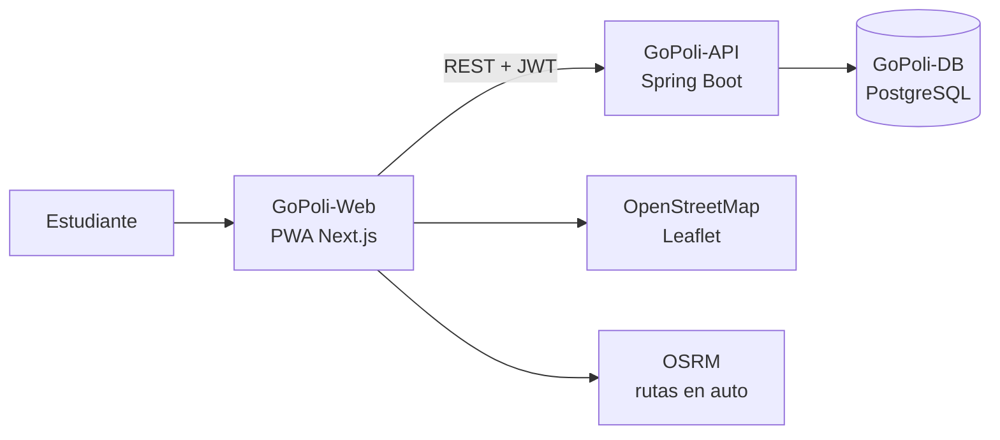
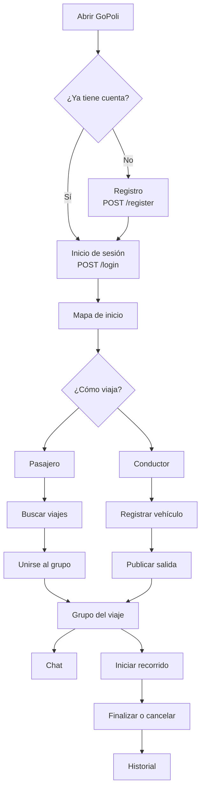
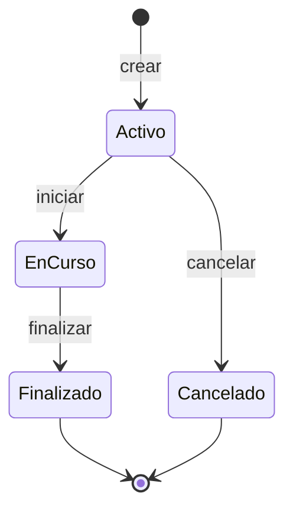

<p align="right">
  <a href="https://github.com/GoPoli/.github/blob/main/profile/README_EN.md">
    
  </a>
</p>

<p align="center">
  
</p>

<h1 align="center">GoPoli</h1>

<p align="center">
  Viajes compartidos entre estudiantes.<br/>
  PWA en el celular, API en el servidor, mapa para encontrarse.
</p>

<p align="center">
  
  
  
  
  
  
  
</p>

---

## Qué es

GoPoli junta estudiantes del Politécnico Colombiano Jaime Isaza Cadavid que van al mismo lugar. Un pasajero busca un cupo. Un conductor publica la salida, la hora y los asientos. El grupo se ve en el mapa, habla por el chat del viaje y cierra el recorrido cuando llega.

---

## Repositorios

| Repositorio | Qué contiene | Imagen | Estado |
| --- | --- | --- | --- |
| [**GoPoli-Web**](https://github.com/GoPoli/GoPoli-Web) | PWA Next.js: pantallas, mapa y sesión en el navegador | `ghcr.io/gopoli/gopoli-web` | [](https://github.com/GoPoli/GoPoli-Web/actions/workflows/node.js.yml) |
| [**GoPoli-API**](https://github.com/GoPoli/GoPoli-API) | API REST Spring Boot: cuentas, viajes, chat y agenda | `ghcr.io/gopoli/gopoli-api` | [](https://github.com/GoPoli/GoPoli-API/actions/workflows/maven.yml) |
| [**GoPoli-DB**](https://github.com/GoPoli/GoPoli-DB) | PostgreSQL con esquema, catálogos y datos de demostración opcionales | `ghcr.io/gopoli/gopoli-db` | [](https://github.com/GoPoli/GoPoli-DB/actions/workflows/ci.yml) |
| [**.github**](https://github.com/GoPoli/.github) | Entornos Docker y Kubernetes, manuales y archivos de comunidad | — | — |
| [**GoPoli-Mobile**](https://github.com/GoPoli/GoPoli-Mobile) | App Flutter original (archivada), reemplazada por la PWA | — | [](https://github.com/GoPoli/GoPoli-Mobile/actions/workflows/flutter.yml) |

---

## Cómo está armado



Cada componente vive en su propio repositorio, tiene su propia CI y publica su imagen en GitHub Container Registry. La PWA guarda el JWT solo en memoria y nunca conoce secretos del servidor.

---

## Probarlo en un minuto

```bash
curl -fsSL --create-dirs -o gopoli-demo/compose.yaml https://raw.githubusercontent.com/GoPoli/.github/main/docker/demo/compose.yaml && docker compose -f gopoli-demo/compose.yaml up -d
```

Abre [http://localhost:3000](http://localhost:3000) e inicia sesión con `demo.local@elpoli.edu.co`, `conductor.demo@elpoli.edu.co` o `pasajera.demo@elpoli.edu.co` (contraseña `gopoli-local-dev`).

---

## Recorrido del estudiante



---

## Ciclo de un viaje



| Estado | Id | Qué significa |
| --- | --- | --- |
| Activo | 1 | Publicado. Todavía se puede unir o salir |
| En curso | 4 | El recorrido ya empezó |
| Finalizado | 3 | Llegaron |
| Cancelado | 2 | Se canceló antes de cerrar |

---

## Qué puedes hacer

- Crear una cuenta con correo `@elpoli.edu.co` e iniciar sesión con JWT.
- Publicar un viaje: fecha, hora, origen, destino y cupos.
- Buscar viajes activos, unirte o salir.
- Registrarte como conductor y asociar un vehículo.
- Ver el mapa (OpenStreetMap) y la ruta en auto (OSRM).
- Hablar en el chat del grupo.
- Guardar rutas habituales en la agenda.
- Revisar el historial y editar el perfil, incluida la foto.
- Instalar la PWA en el celular.

---

## Documentación

| Guía | Contenido |
| --- | --- |
| [Manual de instalación](https://github.com/GoPoli/.github/blob/main/docs/INSTALACION.md) | Demo, desarrollo local, Kubernetes, servidor propio y nube |
| [Entornos Docker](https://github.com/GoPoli/.github/tree/main/docker) | `demo`, `dev` y `production` |
| [Kubernetes](https://github.com/GoPoli/.github/tree/main/kubernetes) | Despliegue endurecido en Docker Desktop o Minikube |
| [CI/CD y GHCR](https://github.com/GoPoli/.github/blob/main/docs/CI_CD.md) | Pipelines, imágenes y configuración de la organización |
| [Matriz de trazabilidad](https://github.com/GoPoli/.github/blob/main/docs/MATRIZ_TRAZABILIDAD_GOPOLIGO.md) | Requisitos y su implementación |
| [Guía de contribución](https://github.com/GoPoli/.github/blob/main/CONTRIBUTING.md) | Flujo de trabajo y estándares |

---

## Autores

- Michael Daniel ([MaicolD0930](https://github.com/MaicolD0930))
- Jorge Martinez ([GeorgeAMS](https://github.com/GeorgeAMS))
- Marian Lasney
- Sebastián López O ([sebastianlopezo](https://github.com/sebastianlopezo))

Proyecto académico del Politécnico Colombiano Jaime Isaza Cadavid, publicado bajo licencia MIT.
