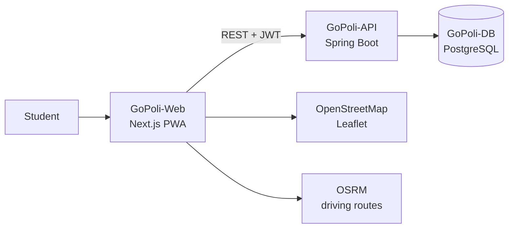
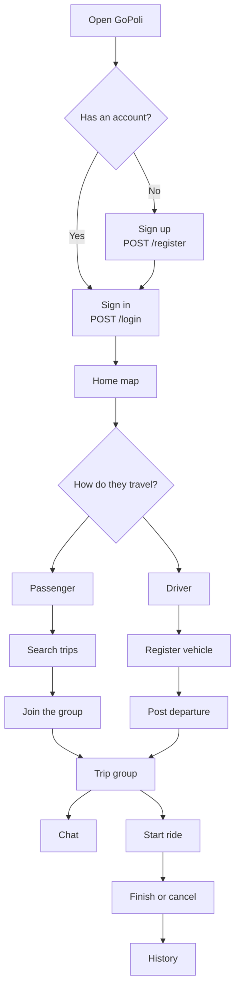
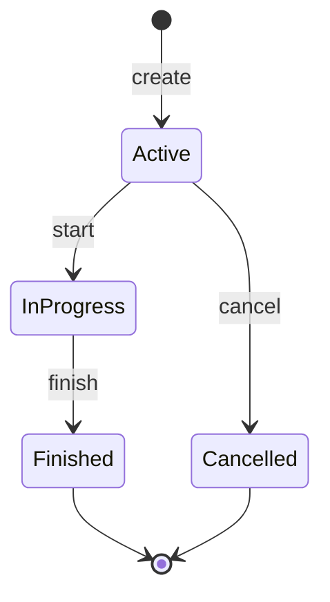

<p align="right">
  <a href="https://github.com/GoPoli">
    
  </a>
</p>

<p align="center">
  
</p>

<h1 align="center">GoPoli</h1>

<p align="center">
  Student ride sharing.<br/>
  A phone PWA, a server API, and a map to meet up.
</p>

<p align="center">
  
  
  
  
  
  
  
</p>

---

## What it is

GoPoli matches students of the Politécnico Colombiano Jaime Isaza Cadavid who are heading to the same place. A passenger looks for a seat. A driver posts the departure, the time, and the open seats. The group shows up on the map, talks in the trip chat, and closes the ride when they arrive.

---

## Repositories

| Repository | What it holds | Image | Status |
| --- | --- | --- | --- |
| [**GoPoli-Web**](https://github.com/GoPoli/GoPoli-Web) | Next.js PWA: screens, map, and browser session | `ghcr.io/gopoli/gopoli-web` | [](https://github.com/GoPoli/GoPoli-Web/actions/workflows/node.js.yml) |
| [**GoPoli-API**](https://github.com/GoPoli/GoPoli-API) | Spring Boot REST API: accounts, trips, chat, and schedule | `ghcr.io/gopoli/gopoli-api` | [](https://github.com/GoPoli/GoPoli-API/actions/workflows/maven.yml) |
| [**GoPoli-DB**](https://github.com/GoPoli/GoPoli-DB) | PostgreSQL with schema, catalogs, and optional demo data | `ghcr.io/gopoli/gopoli-db` | [](https://github.com/GoPoli/GoPoli-DB/actions/workflows/ci.yml) |
| [**.github**](https://github.com/GoPoli/.github) | Docker and Kubernetes environments, manuals, and community files | — | — |
| [**GoPoli-Mobile**](https://github.com/GoPoli/GoPoli-Mobile) | Original Flutter app (archived), replaced by the PWA | — | [](https://github.com/GoPoli/GoPoli-Mobile/actions/workflows/flutter.yml) |

---

## How it is built



Each component lives in its own repository, runs its own CI, and publishes its image to GitHub Container Registry. The PWA keeps the JWT in memory only and never sees server secrets.

---

## Try it in a minute

```bash
curl -fsSL --create-dirs -o gopoli-demo/compose.yaml https://raw.githubusercontent.com/GoPoli/.github/main/docker/demo/compose.yaml && docker compose -f gopoli-demo/compose.yaml up -d
```

Open [http://localhost:3000](http://localhost:3000) and sign in with `demo.local@elpoli.edu.co`, `conductor.demo@elpoli.edu.co`, or `pasajera.demo@elpoli.edu.co` (password `gopoli-local-dev`).

---

## Student path



---

## Trip lifecycle



| State | Id | Meaning |
| --- | --- | --- |
| Active | 1 | Posted. People can still join or leave |
| In progress | 4 | The ride has started |
| Finished | 3 | They arrived |
| Cancelled | 2 | Cancelled before closing |

---

## What you can do

- Sign up with an `@elpoli.edu.co` email and sign in with JWT.
- Post a trip: date, time, origin, destination, and seats.
- Search active trips, join, or leave.
- Register as a driver and add a vehicle.
- See the map (OpenStreetMap) and the driving route (OSRM).
- Talk in the group chat.
- Save usual routes in the schedule.
- Check your history and edit your profile, photo included.
- Install the PWA on your phone.

---

## Documentation

Guides are written in Spanish.

| Guide | Content |
| --- | --- |
| [Installation manual](https://github.com/GoPoli/.github/blob/main/docs/INSTALACION.md) | Demo, local development, Kubernetes, self-hosted server, and cloud |
| [Docker environments](https://github.com/GoPoli/.github/tree/main/docker) | `demo`, `dev`, and `production` |
| [Kubernetes](https://github.com/GoPoli/.github/tree/main/kubernetes) | Hardened deployment on Docker Desktop or Minikube |
| [CI/CD and GHCR](https://github.com/GoPoli/.github/blob/main/docs/CI_CD.md) | Pipelines, images, and organization settings |
| [Contributing guide](https://github.com/GoPoli/.github/blob/main/CONTRIBUTING.md) | Workflow and standards |

---

## Authors

- Michael Daniel ([MaicolD0930](https://github.com/MaicolD0930))
- Jorge Martinez ([GeorgeAMS](https://github.com/GeorgeAMS))
- Marian Lasney
- Sebastián López O ([sebastianlopezo](https://github.com/sebastianlopezo))

Academic project of the Politécnico Colombiano Jaime Isaza Cadavid, released under the MIT license.
